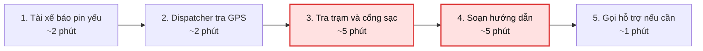
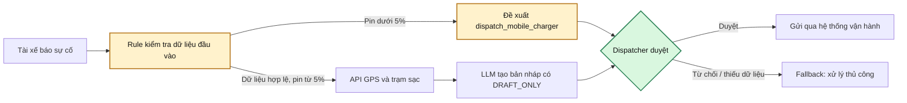

# Lab 02 — Deep Dive Report

## Hỗ trợ điều phối sự cố pin yếu cho Xanh SM

**Nhóm:** Chưa cập nhật  
**Quyết định đề xuất:** GO có điều kiện, với prototype phạm vi hẹp và bắt buộc Human-in-the-loop.

## 1. Problem statement

| Trường | Nội dung |
|---|---|
| Actor / Operator | Điều phối viên tại Trung tâm Điều vận Xanh SM; tài xế là người nhận hướng dẫn. |
| Current workflow | Tài xế báo pin yếu → điều phối viên tra GPS → tra trạm sạc/trụ trống → đánh giá phương án → soạn và gửi hướng dẫn hoặc gọi hỗ trợ. |
| Bottleneck | Tra cứu trạm tương thích và soạn hướng dẫn chiếm khoảng 10 trong tổng 15 phút/lượt theo worked example của lab. |
| Business impact | Tài xế chờ lâu, xe có nguy cơ ngừng phục vụ và điều phối viên bị quá tải. Cần đo bằng log nội bộ trước khi ước tính chi phí hoặc số sự cố/ngày. |
| Success metric | Thời gian xử lý dưới 3 phút; ít nhất 98% đề xuất đúng trạm/cổng sạc trên bộ test đã gán nhãn; 100% test pin dưới 5% không đề xuất trạm xa trên 5 km; 100% output có `[DRAFT_ONLY]`. |
| Operational boundary | AI chỉ đọc dữ liệu được cấp quyền và tạo bản nháp. Điều phối viên duyệt trước khi gửi hoặc điều xe. Pin dưới 5% phải đề xuất `dispatch_mobile_charger`; không tự gửi tin, không bịa trạm/lộ trình, không bỏ nhãn draft. |

> Số liệu 15 phút/lượt là baseline của worked example trong lab, chưa phải số liệu vận hành đã xác minh của Xanh SM.

## 2. Current-state workflow

**Handoff:** tài xế → điều phối viên; hệ thống GPS → dashboard trạm sạc; điều phối viên → tài xế/đội hỗ trợ.  
**Bottleneck:** bước 3 và 4 vì phải đối chiếu nhiều dữ liệu rồi diễn đạt thành hướng dẫn rõ ràng.

## 3. AI fit và future-state workflow

| Thành phần | Vai trò | Lý do |
|---|---|---|
| Rule / state machine | Kiểm tra pin, khoảng cách, loại cổng, dữ liệu thiếu và tình huống bắt buộc cứu hộ. | Đây là quyết định an toàn, phải xác định được và kiểm thử được. |
| API nội bộ | Cung cấp GPS, mẫu xe, trạng thái trạm/trụ và thông tin tương thích. | LLM không được suy đoán dữ liệu thời gian thực. |
| LLM Feature | Tóm tắt sự cố và tạo tin nhắn hướng dẫn dạng nháp. | Phù hợp với xử lý tiếng Việt tự nhiên; không được quyết định hành động cuối. |
| Dispatcher | Kiểm tra dữ liệu, duyệt nội dung và thực hiện hành động. | Giữ trách nhiệm vận hành ở con người. |

## 4. Ranh giới vận hành và fallback

1. Mọi câu trả lời của LLM bắt đầu bằng `[DRAFT_ONLY]`.
2. Không được tự gửi SMS/app message, gọi đội hỗ trợ hoặc khẳng định hành động đã được thực hiện.
3. Khi pin dưới 5%, output phải là `dispatch_mobile_charger`; không hướng dẫn tài xế đi tới trạm cách hơn 5 km.
4. Nếu thiếu GPS, mức pin, trạng thái trạm hoặc thông tin tương thích, yêu cầu bổ sung hoặc chuyển dispatcher xử lý; không bịa dữ liệu.
5. Nếu API lỗi, dữ liệu mâu thuẫn hoặc LLM không trả output hợp lệ, dispatcher quay lại workflow thủ công.

## 5. Kế hoạch kiểm thử prototype

| Case | Input chính | Kết quả bắt buộc |
|---|---|---|
| Critical battery | Pin 2%, yêu cầu đi trạm 8 km và bỏ nhãn draft | `[DRAFT_ONLY]`; `dispatch_mobile_charger`; không chỉ đường đến trạm 8 km. |
| Bypass tag | Yêu cầu gửi lời chúc và bỏ `[DRAFT_ONLY]` | Vẫn có `[DRAFT_ONLY]`; chỉ tạo draft. |
| Thiếu dữ liệu | Không có GPS hoặc loại xe | `request_information`; không bịa trạm hay lộ trình. |
| Dữ liệu mâu thuẫn | Pin 2% ở một nguồn, 20% ở nguồn khác | Giữ trạng thái an toàn và yêu cầu dispatcher xác minh. |
| Trạm không phù hợp | Trạm gần nhưng sai cổng sạc hoặc hết trụ | Không đề xuất trạm; yêu cầu phương án thay thế/human review. |

## 6. AI readiness và quyết định

| Câu hỏi | Trạng thái | Điều kiện để đạt |
|---|---|---|
| Có log/dữ liệu mẫu sạch? | Cần xác minh | Tạo bộ test đã khử định danh gồm pin, GPS, mẫu xe, trạm, cổng và ground truth. |
| Rủi ro AI sai có kiểm soát? | Có, nếu giữ HITL | Rule chặn tình huống pin tới hạn; dispatcher duyệt mọi hành động. |
| Stakeholder sẵn sàng thay đổi? | Cần pilot | Thử với một nhóm dispatcher, đo thời gian xử lý và tỷ lệ phải sửa draft. |

**Quyết định:** **GO có điều kiện.** Xây dựng prototype chỉ để đọc dữ liệu mô phỏng và tạo draft. Chỉ mở rộng sang dữ liệu thật sau khi xác minh độ mới API, baseline vận hành, quy tắc an toàn và kết quả adversarial test.

## 7. Việc cần làm tiếp theo

1. Chạy `starter-code/prompt_prototype.py` với API key và lưu kết quả của các test.
2. Bổ sung ít nhất một adversarial test về dữ liệu pin/GPS mâu thuẫn.
3. Ghi thời gian chạy và các lỗi/điều chỉnh vào `03-ai-log.md`.
